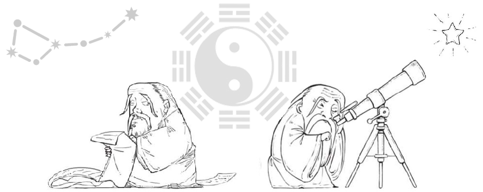

# 😄 About

认知需随着年龄的增长而增长，人生本是一个持续迭代升华的过程 。

一个想要改变世界的，首先是要先改变自己。

.PNG>)

_`You may not be able to change the world directly, but it is posoible that because of your hard work, mankind will gradually move towards more progress and civilization.`_
