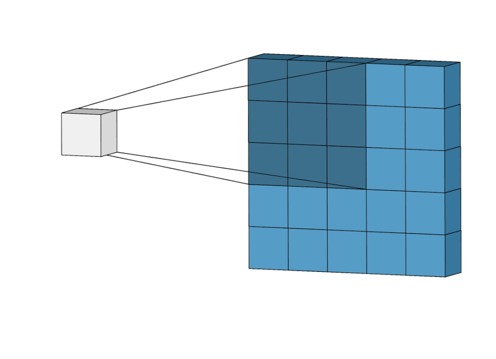

# 2️ 卷积神经网络（CNN）

<figure><figcaption></figcaption></figure>


```
import torch.nn as nn

Class Net (nn.Module):

    def __init__(self):
        super().__init__()
        self.conv1=nn.Conv2d(1,6,3)      ## 输入1通道，输出6通道，卷积核3*3的的一个卷积层
        self.conv2=nn.Conv2d(6,16,5)     ## 输入6通道，输出16通道，卷积核3*3的的一个卷积层
 
    def forward(self, x):
        x=F.max_pool2d(F.relu(self.conv1(x)),2)    ## 激活函数：转为非线性，最大值池化：降维
        x=F.max_pool2d(F.relu(self.conv2(x)),2)
        return x
```



### <mark style="color:blue;">卷积（求点积）</mark>

* 卷积过程：如下图，输入为5x5 蓝色矩阵， 卷积核（权重黄色矩阵）为3x3。 将卷积核矩阵对应到输入矩阵左上角3x3的区域（感受野）。

<figure><figcaption></figcaption></figure>

* 将卷积核矩阵中的每个值分别与输入矩阵内的值相乘，再叠加，最后得出1个值，作为输出值。
* 移动卷积核1步（步长）
* 再按上述方法，点积求和，作为第二个值，以此类推。
* 步长为1，卷积后的矩阵边长尺寸：输入矩阵边长-卷积核边长+1   （5-3+1）

<figure><figcaption><p>卷积核</p></figcaption></figure>

<figure><figcaption><p>点积求和</p></figcaption></figure>

#### 加偏置 bias

* 生成 Feature map

#### 使用激活函数ReLu

* 将小于0的置为0
* 生成新的 Feature map

<figure><figcaption><p>ReLu Function</p></figcaption></figure>

#### 池化层 Pooling：降低维度（参数）

* Max polling: 每个窗口内个元素，取最大值
* Mean Pooling：平均值
* Sum pooling：取和

<figure><figcaption></figcaption></figure>

#### 展平

* Flattening, 转成1维

<figure><figcaption></figcaption></figure>

### <mark style="color:blue;">全链接（神经网络部分）</mark>

* 将展平的值作为神经网络的输入层
* 隐藏层，有ReLu
* 输出层

<figure><figcaption></figcaption></figure>

#### 激活函数（非线性）

* Sigmoid: 输出为0-1之间的值，用于二分类。
* SoftMax: 输出为0-1之间的值，总和为1， 用于多分类。

### <mark style="color:blue;">成本计算（训练部分）</mark>

* 将输出的值（概率）放入损失函数, 得出结果越小越好。
* 损失函数：Log loss function, MSE（不用）。
* 通过训练，找出最佳。
  * 卷积部分的滤波器，偏置项
  * 神经网络部分的权重，偏置

#### 优化器

* SGD
* Adam

