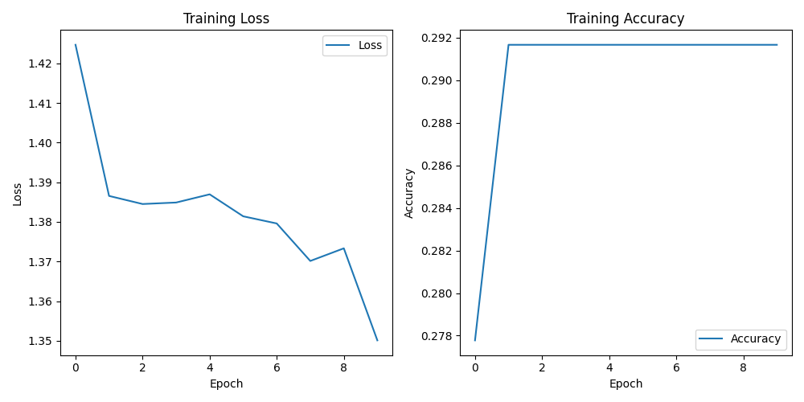

# 3D CNN sample code


```python
import torch
import torch.nn as nn
import torch.optim as optim
import torch.nn.functional as F
from torch.utils.data import Dataset, DataLoader
import matplotlib.pyplot as plt

# 定义一个简单的合成数据集
class SyntheticDataset(Dataset):
    def __init__(self, num_samples, num_classes):
        self.num_samples = num_samples
        self.num_classes = num_classes
        self.data = torch.randn(num_samples, 1, 64, 64, 64)
        self.targets = torch.randint(0, num_classes, (num_samples,))
        self.normalize_data()

    def normalize_data(self):
        # 归一化数据，使每个样本的数据值在0到1之间
        self.data = self.data / self.data.max()

    def __len__(self):
        return self.num_samples

    def __getitem__(self, idx):
        return self.data[idx], self.targets[idx]

# 定义3D CNN模型
class Simple3DCNN(nn.Module):
    def __init__(self, num_classes):
        super(Simple3DCNN, self).__init__()
        self.conv1 = nn.Conv3d(1, 16, kernel_size=3, padding=1)
        self.pool = nn.MaxPool3d(2, 2)
        self.conv2 = nn.Conv3d(16, 32, kernel_size=3, padding=1)
        self.conv3 = nn.Conv3d(32, 64, kernel_size=3, padding=1)
        self.fc1 = nn.Linear(64 * 8 * 8 * 8, 512)
        self.fc2 = nn.Linear(512, num_classes)

    def forward(self, x):
        x = self.pool(F.relu(self.conv1(x)))
        x = self.pool(F.relu(self.conv2(x)))
        x = self.pool(F.relu(self.conv3(x)))
        x = torch.flatten(x, 1)
        x = F.relu(self.fc1(x))
        x = self.fc2(x)
        return x

# 创建合成数据集实例
num_samples = 100
num_classes = 4
dataset = SyntheticDataset(num_samples, num_classes)

# 创建数据加载器
batch_size = 10
train_loader = DataLoader(dataset, batch_size=batch_size, shuffle=True)

# 实例化模型
model = Simple3DCNN(num_classes)

# 损失函数和优化器
criterion = nn.CrossEntropyLoss()
optimizer = optim.Adam(model.parameters(), lr=0.001)

# 训练模型
def train_model(model, train_loader, criterion, optimizer, num_epochs=10):
    loss_list = []
    accuracy_list = []

    for epoch in range(num_epochs):
        model.train()
        running_loss = 0.0
        running_corrects = 0

        for inputs, labels in train_loader:
            optimizer.zero_grad()
            outputs = model(inputs)
            loss = criterion(outputs, labels)
            loss.backward()
            optimizer.step()

            running_loss += loss.item() * inputs.size(0)
            _, preds = torch.max(outputs, 1)
            running_corrects += torch.sum(preds == labels.data)

        epoch_loss = running_loss / len(train_loader.dataset)
        epoch_acc = running_corrects.double() / len(train_loader.dataset)
        loss_list.append(epoch_loss)
        accuracy_list.append(epoch_acc.item())

        print(f'Epoch {epoch+1}/{num_epochs}, Loss: {epoch_loss:.4f}, Accuracy: {epoch_acc:.4f}')

    # 绘制损失和精度曲线
    plt.figure(figsize=(10, 5))
    plt.subplot(1, 2, 1)
    plt.plot(loss_list, label='Loss')
    plt.title('Training Loss')
    plt.xlabel('Epoch')
    plt.ylabel('Loss')
    plt.legend()

    plt.subplot(1, 2, 2)
    plt.plot(accuracy_list, label='Accuracy')
    plt.title('Training Accuracy')
    plt.xlabel('Epoch')
    plt.ylabel('Accuracy')
    plt.legend()

    plt.tight_layout()
    plt.show()

# 调用训练函数
train_model(model, train_loader, criterion, optimizer, num_epochs=10)

```



```python
import torch
import torch.nn as nn
import torch.optim as optim
import torch.nn.functional as F
from torch.utils.data import Dataset, DataLoader
import matplotlib.pyplot as plt

# 定义一个简单的合成数据集
class SyntheticDataset(Dataset):
    def __init__(self, num_samples, num_classes):
        self.num_samples = num_samples
        self.num_classes = num_classes
        self.data = torch.randn(num_samples, 1, 64, 64, 5)
        self.targets = torch.randint(0, num_classes, (num_samples,))
        self.normalize_data()

    def normalize_data(self):
        # 归一化数据，使每个样本的数据值在0到1之间
        self.data = self.data / self.data.max()

    def __len__(self):
        return self.num_samples

    def __getitem__(self, idx):
        return self.data[idx], self.targets[idx]


# 定义3DCNN模型
class Simple3DCNN(nn.Module):

    def __init__(self, num_classes=4):
        super(Simple3DCNN, self).__init__()
        # 定义3D卷积层，输入通道数为1
        self.conv1 = nn.Conv3d(in_channels=1,
                               out_channels=16,
                               kernel_size=(3, 3, 3),
                               padding=1)
        self.conv2 = nn.Conv3d(in_channels=16,
                               out_channels=32,
                               kernel_size=(3, 3, 3),
                               padding=1)
        # 定义池化层
        self.pool = nn.MaxPool3d(kernel_size=(2, 2, 2))
        # 定义全连接层，根据实际计算调整输入特征数
        self.fc1 = nn.Linear(32 * 16 * 16, 512)
        self.fc2 = nn.Linear(512, num_classes)

    def forward(self, x):
        # 通过第一个卷积层后接ReLU激活函数和池化层
        x = self.pool(nn.functional.relu(self.conv1(x)))
        # 通过第二个卷积层后接ReLU激活函数和池化层
        x = self.pool(nn.functional.relu(self.conv2(x)))
        # 展平特征图以输入到全连接层
        x = x.view(-1, 32 * 16 * 16)
        # 通过第一个全连接层后接ReLU激活函数
        x = nn.functional.relu(self.fc1(x))
        # 通过第二个全连接层得到最终输出
        x = self.fc2(x)
        return x


# 创建合成数据集实例
num_samples = 72
num_classes = 4
dataset = SyntheticDataset(num_samples, num_classes)

# 创建数据加载器
batch_size = 1
train_loader = DataLoader(dataset, batch_size=batch_size, shuffle=True)

# 实例化模型
model = Simple3DCNN(num_classes)

# 打印模型结构
print(model)


# 损失函数和优化器
criterion = nn.CrossEntropyLoss()
optimizer = optim.Adam(model.parameters(), lr=0.001)

# 训练模型
def train_model(model, train_loader, criterion, optimizer, num_epochs=10):
    loss_list = []
    accuracy_list = []

    for epoch in range(num_epochs):
        model.train()
        running_loss = 0.0
        running_corrects = 0

        for inputs, labels in train_loader:
            optimizer.zero_grad()
            outputs = model(inputs)
            loss = criterion(outputs, labels)
            loss.backward()
            optimizer.step()

            running_loss += loss.item() * inputs.size(0)
            _, preds = torch.max(outputs, 1)
            running_corrects += torch.sum(preds == labels.data)

        epoch_loss = running_loss / len(train_loader.dataset)
        epoch_acc = running_corrects.double() / len(train_loader.dataset)
        loss_list.append(epoch_loss)
        accuracy_list.append(epoch_acc.item())

        print(f'Epoch {epoch+1}/{num_epochs}, Loss: {epoch_loss:.4f}, Accuracy: {epoch_acc:.4f}')

    # 绘制损失和精度曲线
    plt.figure(figsize=(10, 5))
    plt.subplot(1, 2, 1)
    plt.plot(loss_list, label='Loss')
    plt.title('Training Loss')
    plt.xlabel('Epoch')
    plt.ylabel('Loss')
    plt.legend()

    plt.subplot(1, 2, 2)
    plt.plot(accuracy_list, label='Accuracy')
    plt.title('Training Accuracy')
    plt.xlabel('Epoch')
    plt.ylabel('Accuracy')
    plt.legend()

    plt.tight_layout()
    plt.show()

# 调用训练函数
train_model(model, train_loader, criterion, optimizer, num_epochs=10)

```


<figure><figcaption></figcaption></figure>
