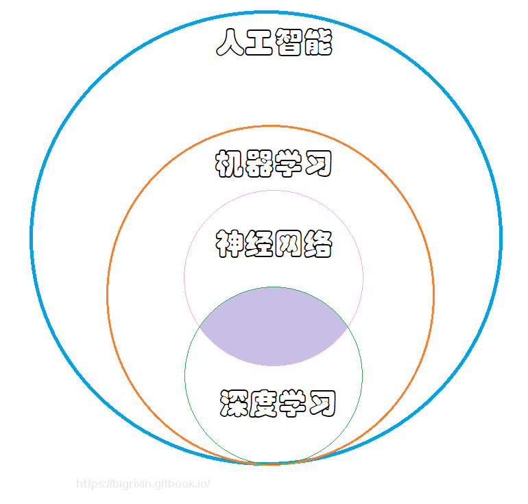

# 人工智能，机器学习，深度学习 和神经网络的区别

1. 人工智能（Artificial Intelligence，AI）：
   * 人工智能是一门计算机科学的分支，旨在创建能够模拟人类智能行为的系统。
   * AI 的目标是使计算机系统能够执行类似于人类的智能任务，如理解语言、解决问题、学习、规划和自我改善等。
   * AI 可以使用各种技术和方法，包括机器学习和深度学习。\

2. 机器学习（Machine Learning）：
   * 机器学习是人工智能的一个子领域，专注于让计算机系统通过数据学习并改善性能，而无需明确编程。
   * 机器学习算法使计算机能够从数据中学习模式并做出预测或决策，而无需进行明确的规则编码。
   * 机器学习包括监督学习、无监督学习、半监督学习和强化学习等不同类型。\

3. 深度学习（Deep Learning）：
   * 深度学习是机器学习的一个分支，它模仿人类大脑的结构和功能，通过构建深层次的神经网络来学习数据表示。
   * 深度学习的核心是神经网络，其具有多个层次（深度）来提取数据的高级特征。
   * 深度学习已经在图像识别、语音识别、自然语言处理等领域取得了显著的成功。\

4. 神经网络（Neural Networks）：
   * 神经网络是深度学习的基础，它模拟人脑神经元之间的连接和信号传递。
   * 神经网络由多个神经元组成，这些神经元被组织成层次结构，每一层都与下一层的神经元相连。
   * 通过向神经网络输入数据并调整网络内部参数，可以训练网络以执行各种任务，如分类、回归等。

<figure><figcaption></figcaption></figure>

***

&#x20;**机器学习处理流程通常包括以下步骤：**

1. 数据收集：收集并整理用于训练和测试模型的数据集。数据可以来自各种来源，如数据库、文件、传感器等。
2. 数据预处理：对收集到的数据进行清洗、处理和转换，以准备好输入模型进行训练。这可能包括缺失值填充、特征选择、特征缩放、数据标准化等。
3. <mark style="color:orange;">特征工程</mark>：<mark style="color:green;">根据问题的需求和数据的特点，设计并构建适当的特征。这可能包括从原始数据中提取新特征、组合现有特征、进行降维等操作。</mark>
4. <mark style="color:orange;">模型选择</mark>：选择适合问题类型的机器学习<mark style="color:green;">模型</mark>，如回归、分类、聚类等，并根据实际情况选择合适的算法。
5. 模型训练：使用训练数据集对选定的模型进行训练，即通过学习数据的模式和规律来调整模型的参数，使其能够对新数据进行准确的预测或分类。
6. 模型评估和验证：使用测试数据集评估训练好的模型的性能和泛化能力。常用的评估指标包括准确率、精确率、召回率、F1分数等。
7. 超参数调优：对模型的超参数进行调优，以进一步提高模型的性能和泛化能力。这可能涉及到网格搜索、随机搜索、贝叶斯优化等方法。
8. 模型部署：将训练好的模型部署到实际应用中，以便对新数据进行预测或分类。这可能涉及到将模型集成到软件系统中，或者将模型封装为API供其他应用调用。

**深度学习处理流程通常包括以下步骤：**

1. 数据收集：收集并整理用于训练和测试深度学习模型的数据集。数据可以是图像、文本、声音等形式，并且通常需要大量的标注数据。
2. 数据预处理：对收集到的数据进行清洗、处理和转换，以准备好输入模型进行训练。这可能包括图像的大小调整、颜色空间转换、文本的分词和编码、声音的特征提取等。
3. <mark style="color:purple;">构建模型架构</mark>：选择适合问题类型的深度学习<mark style="color:green;">模型架构</mark>，如卷积神经网络（CNN）、循环神经网络（RNN）、长短期记忆网络（LSTM）、变换器（Transformer）等，并设计网络的层次结构和连接方式。
4. 模型训练：使用训练数据集对选定的深度学习模型进行训练，即通过反向传播算法和优化器调整模型的参数，使其能够对新数据进行准确的预测或分类。
5. 模型评估和验证：使用测试数据集评估训练好的深度学习模型的性能和泛化能力。常用的评估指标包括准确率、精确率、召回率、F1分数等。
6. 超参数调优：对模型的超参数进行调优，以进一步提高模型的性能和泛化能力。这可能涉及到学习率调整、批量大小选择、正则化方法等。
7. 模型部署：将训练好的深度学习模型部署到实际应用中，以便对新数据进行预测或分类。这可能涉及到将模型集成到软件系统中，或者将模型封装为API供其他应用调用。

\
\
**神经网络处理流程通常包括以下步骤：**

1. 数据收集：收集并整理用于训练和测试神经网络模型的数据集。数据可以是图像、文本、声音等形式，并且通常需要大量的标注数据。
2. 数据预处理：对收集到的数据进行清洗、处理和转换，以准备好输入模型进行训练。这可能包括图像的大小调整、颜色空间转换、文本的分词和编码、声音的特征提取等。
3. <mark style="color:green;">构建神经网络模型</mark>：选择适合问题类型的神经网络模型，如多层感知器（Multilayer Perceptron，MLP）、卷积神经网络（Convolutional Neural Network，CNN）、循环神经网络（Recurrent Neural Network，RNN）等，并设计网络的层次结构和连接方式。
4. 模型训练：使用训练数据集对选定的神经网络模型进行训练，即通过反向传播算法和优化器调整模型的参数，使其能够对新数据进行准确的预测或分类。
5. 模型评估和验证：使用测试数据集评估训练好的神经网络模型的性能和泛化能力。常用的评估指标包括准确率、精确率、召回率、F1分数等。
6. 超参数调优：对模型的超参数进行调优，以进一步提高模型的性能和泛化能力。这可能涉及到学习率调整、批量大小选择、正则化方法等。
7. 模型部署：将训练好的神经网络模型部署到实际应用中，以便对新数据进行预测或分类。这可能涉及到将模型集成到软件系统中，或者将模型封装为API供其他应用调用。

