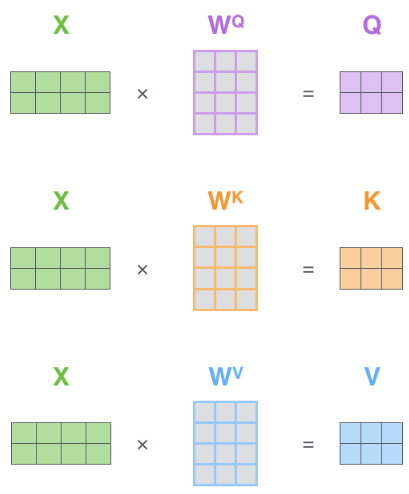
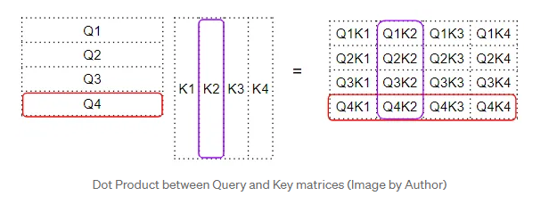
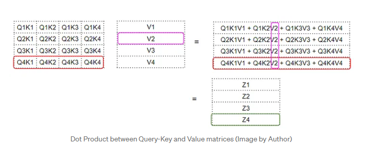
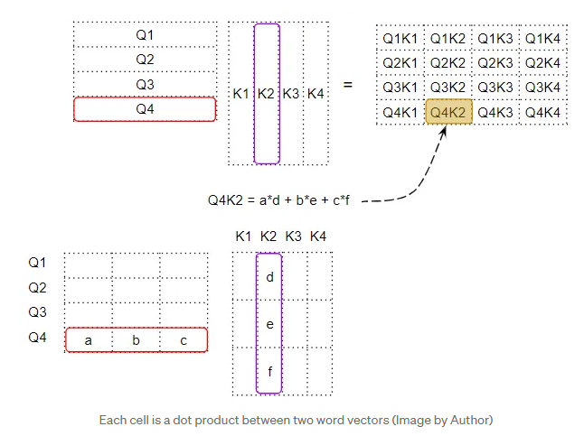

# 3️ Transformer 原理

Trasnformer 是基于循环神经网络Recurrent Neural Network (**RNN**) , 加入自注意力机制 **(Self-Attention)** 的深度学习模型。

* _<mark style="color:blue;">RNN是一种序列模型，可以得到序列信息（前一个的顺序会传给后面）。但是，RNN 只能顺序执行，不能并行计算，若数据量大，早期信息容易丢失。Attention 可以并行。</mark>_
* _<mark style="color:blue;">CNN可以做多通道输出，但是，对于长数据，难以建模。</mark>_
* _<mark style="color:blue;">序列模型中比较好的是 Encoder-Decoder架构。</mark>_

\
Trasnformer 包含了两个主要组成：Encoder 和 Decoder。 (序列模型)

* Encoder里边有6个小编码器，每一个的小编码器的输入是前一个小编码器的输出。
* Decoders里边也有6个小解码器。每一个小解码器的输入，不光是它的前一个解码器的输出，还包括了整个编码部分的输出。

1. <mark style="color:purple;">**Encoder**</mark>

Encoder 的结构是一个**自注意力机制(Self-Attention)** + **前馈神经网络(FFN)**。

**自注意力机制 self-attention**：是自己和自己计算一遍注意力(即 q, k, v 可以互换，是自身)。 输入为一个向量，再乘以三个矩阵，得到三个新的向量。如下图：输入向量为X, 乘以 WQ，WK，WV矩阵，就会分别得到新的权重矩阵 Q，K，V。

(Q: Query, K: key, V: value。K 和 V长度相同)

<figure><figcaption></figcaption></figure>

**Attention:** 将新向量内容分别与K1, K2, Kt 向量进来点积运算，得到相似度（值越大，相似度越高）。再除以根号dk。再将结果进行softmax运算，即：将分数标准化, 归一化运算。(得到大约0，小于1的数，总和为1的权重).

<figure><figcaption></figcaption></figure>

最后，将上述结果分别与V1，V2，Vt 向量进来点积运算，再将结果加起来，得到一个权重矩阵Z。\

<figure><figcaption></figcaption></figure>

<figure><figcaption></figcaption></figure>

## <mark style="color:blue;">通过Softmax 将高分值，分给重要的词</mark>

**自注意力机制**：Q, K, V 都来自内部，与外部无关。\
&#x20;                           \
Q向量 与 K向量的转置 点积， 生成因子矩阵，如下图：

<figure><figcaption>
<a href="https://towardsdatascience.com/transformers-explained-visually-not-just-how-but-why-they-work-so-well-d840bd61a9d3">Author</a>: <a href="https://ketanhdoshi.medium.com/?source=post_page-----d840bd61a9d3--------------------------------">Ketan Doshi</a>
</figcaption></figure>

矩阵 再与 V向量 进行加权合计算， 得到 Z 注意力分数向量  (Attention Score Vector)&#x20;

&#x20;         <mark style="color:orange;">**Z4 = Q4K1V1 + Q4K2V2 + Q4K3V3 + Q4K4V4**</mark>

<figure><figcaption>
<a href="https://towardsdatascience.com/transformers-explained-visually-not-just-how-but-why-they-work-so-well-d840bd61a9d3">Author</a>: <a href="https://ketanhdoshi.medium.com/?source=post_page-----d840bd61a9d3--------------------------------">Ketan Doshi</a>
</figcaption></figure>

<figure><figcaption>
<a href="https://towardsdatascience.com/transformers-explained-visually-not-just-how-but-why-they-work-so-well-d840bd61a9d3">Author</a>: <a href="https://ketanhdoshi.medium.com/?source=post_page-----d840bd61a9d3--------------------------------">Ketan Doshi</a>
</figcaption></figure>

**多头注意力机制**，顾名思义，包含多个自注意力机制，然后将多个自注意力机制的输出进行拼接，最后通过全连接层得到输出。

<figure><figcaption>
使用多头注意力是为了增加学习机会，即W. h=8个头。 d(model)/h=64
</figcaption></figure>

输入X, 通过上述方法，得到多组Q/K/V权重矩阵，

<figure><figcaption></figcaption></figure>

然后按照上节描述的那样，得到多个Z。

<figure><figcaption></figcaption></figure>

<figure><figcaption>
计算图
</figcaption></figure>

<figure><figcaption></figcaption></figure>

对多个注意力机制的输出Z进行拼接, 就得到了self-attention层的输出。

<figure><figcaption></figcaption></figure>

最后, 再乘以一个矩阵，得到一个前馈神经网络层的输入。

**总结一下：** Encoder的架构是对输入进行编码，使用自注意力机制 + 前馈神经网络Position-Wise Feed-Forward Network (FFN) 的结构。\
\

<figure><figcaption>
Position-wise Feed-Forward Network
</figcaption></figure>

2. <mark style="color:purple;">**Decoder**</mark>

**Decoder中使用的也是同样的结构。** 不同的地方在于，在Encoder的前端增加了一个掩码(Masked)多头自注意力机制（t时间后的信息置为0), 其输出Q。再与前面的 Encoder 的输出（K, V）, 作为输入, 进入下一层类似一个Encoder 模块。其输出，计算一遍注意力机制的得分（点积加权平均）。 最后，再进入前馈神经网络模块。

解码器输出本来是一个浮点型的向量。如何实现将“机器学习”翻译成“machine learing”。

3. <mark style="color:purple;">输入，输出</mark>

Decoder 后，接上一个softmax变成一个线性层。 使用全连接神经网络，它将解码器产生的向量投影到一个更高维度的向量（logits）上。 之后的softmax层将这些分数转换为概率。选择概率最大的维度， 并对应地生成与之关联的单词作为此时间步的输出就是最终的输出。

但是，上述方法不含有顺序信息。**为了实现Transformer的顺序信息，**&#x5728;每个输入词向量加上一个有顺序特征的向量（Positional Encoding)， 研究发现sin和cos函数能够很好的表达这种特征。

<figure><figcaption>
The Transformer - model architecture
</figcaption></figure>

***

**输入 Embedding**: 转换输入和输出(Softmax前) token 映射到一个 512维度 的向量里。在Embedding层是将权重 乘以根号d, (d=512)

**输出 Positional Encoding：**&#x41;ttention的输出是一个Value的加权和，没有时序信息。权重是Query与Key之间的距离。意味着，输入不同的顺序词，输出的值相同。为了使得Attention含有顺序信息，使用的Sin , Cos 函数（-1 \~ +1）。

***

Reference:&#x20;

[https://towardsdatascience.com/transformers-explained-visually-not-just-how-but-why-they-work-so-well-d840bd61a9d3](https://towardsdatascience.com/transformers-explained-visually-not-just-how-but-why-they-work-so-well-d840bd61a9d3)\
[https://papers.nips.cc/paper\_files/paper/2017/file/3f5ee243547dee91fbd053c1c4a845aa-Paper.pdf](https://papers.nips.cc/paper_files/paper/2017/file/3f5ee243547dee91fbd053c1c4a845aa-Paper.pdf)\
[https://mp.weixin.qq.com/s/slOlE8fe91jZBMYhAV9Z7A
\
https://mp.weixin.qq.com/s?\_\_biz=Mzg3MjY1MzExMA==\&mid=2247514134\&idx=1\&sn=2efa12ff4b0c5211a2bdc13596cc44b9\&chksm=cfb6f9ebd0f6539bc5bbcdd305f27b47a3546100e444b43ac2a8e78c8e48a280aea55d61bcc2\&scene=132\&exptype=timeline\_recommend\_article\_extendread\_samebiz\&show\_related\_article=1\&subscene=0\&poc\_token=HC0s7mWjrZK5vW9esQvZFLfHgXa8Sqph7wWBf-Wb
\
https://blog.csdn.net/keyue123/article/details/89209888](https://mp.weixin.qq.com/s/slOlE8fe91jZBMYhAV9Z7Ahttps:/mp.weixin.qq.com/s?__biz=Mzg3MjY1MzExMA==\&mid=2247514134\&idx=1\&sn=2efa12ff4b0c5211a2bdc13596cc44b9\&chksm=cfb6f9ebd0f6539bc5bbcdd305f27b47a3546100e444b43ac2a8e78c8e48a280aea55d61bcc2\&scene=132\&exptype=timeline_recommend_article_extendread_samebiz\&show_related_article=1\&subscene=0\&poc_token=HC0s7mWjrZK5vW9esQvZFLfHgXa8Sqph7wWBf-Wbhttps://blog.csdn.net/keyue123/article/details/89209888)
