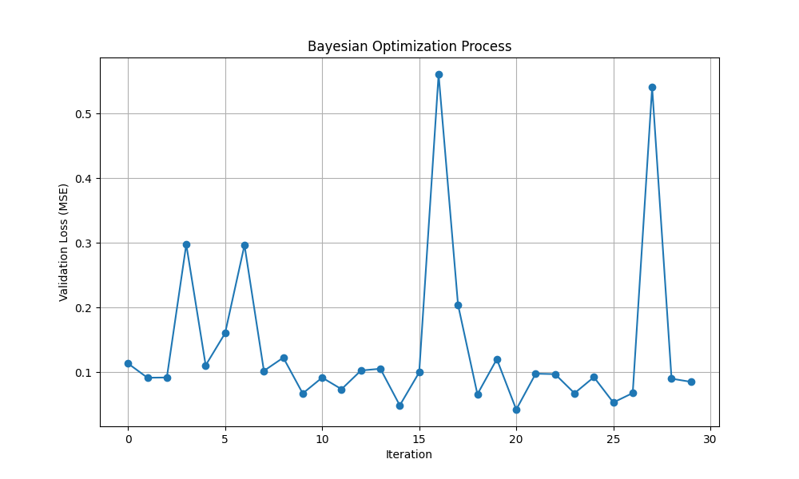
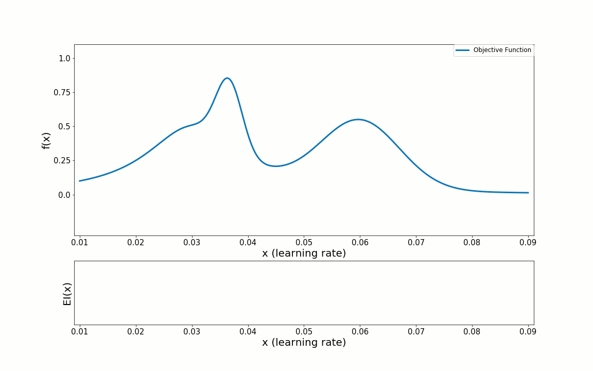

# 贝叶斯优化

1. **用高斯过程 Gaussian Process（GP) 将已有数据来预测未知区域的可能值。**
2. **用采集函数（Acquisition Function）决定下一个采样点**。
3. **不断更新模型，逐步逼近全局最优解**。


```
import torch
import torch.nn as nn
import torch.nn.functional as F
import torch.optim as optim
from torch.utils.data import DataLoader, Dataset
import numpy as np
from skopt import gp_minimize
from skopt.space import Real, Integer, Categorical
from skopt.utils import use_named_args
import time
import copy
from model import *  ###


# 训练函数
def train_model(model, train_loader, val_loader, criterion, optimizer, device, num_epochs=5):
    model = model.to(device)
    best_val_acc = 0.0
    best_model = None
    
    for epoch in range(int(num_epochs)):
        model.train()
        running_loss = 0.0
        
        for inputs, labels in train_loader:
            inputs, labels = inputs.to(device), labels.to(device)
            
            optimizer.zero_grad()
            outputs = model(inputs, inputs)
            loss = criterion(outputs, labels)
            loss.backward()
            optimizer.step()
            
            running_loss += loss.item()
        
        # 验证
        val_acc = evaluate_model(model, val_loader, device)
        print(f'Epoch {epoch+1}/{num_epochs}, Loss: {running_loss/len(train_loader):.4f}, Val Acc: {val_acc:.4f}')
        
        if val_acc > best_val_acc:
            best_val_acc = val_acc
            best_model = copy.deepcopy(model)
    
    return best_model, best_val_acc

# 评估函数
def evaluate_model(model, data_loader, device):
    model.eval()
    correct = 0
    total = 0
    
    with torch.no_grad():
        for inputs, labels in data_loader:
            inputs, labels = inputs.to(device), labels.to(device)
            outputs = model(inputs, inputs)
            _, predicted = torch.max(outputs, 1)
            total += labels.size(0)
            correct += (predicted == labels).sum().item()
    
    return correct / total

# 定义超参数空间
dimensions = [
    # CNN参数
    Integer(16, 64, name='conv1_channels'),
    Integer(32, 128, name='conv2_channels'),
    Categorical([3, 5], name='kernel_size'),
    Categorical([True, False], name='use_leaky_relu'),  ## 激活函数
    Real(0.2, 0.7, name='dropout_rate'),                ## regularization 正则化
    
    # LSTM参数
    Integer(64, 256, name='lstm_hidden'),
    Integer(1, 3, name='lstm_layers'),
    
    # 融合模型参数
    Integer(128, 512, name='fc1_units'),
    
    # 训练参数
    Real(1e-4, 1e-2, prior='log-uniform', name='learning_rate'),
    Integer(16, 128, name='batch_size'),
    Categorical(['adam', 'sgd'], name='optimizer'),     ## 优化器
    Real(0, 0.001, name='weight_decay')                 ## 损失函数权重
]

# 目标函数 - 贝叶斯优化将尝试最小化此函数
@use_named_args(dimensions)
def objective(**params):
    start_time = time.time()
    
    # 打印当前测试的超参数组合
    print(f"Testing hyperparameters: {params}")
    
    # 创建模型，确保所有整数值参数转换为Python原生int
    model = Fusion_CNN2D_LSTM_Model(
        input_channel=5,
        conv1_channels=int(params['conv1_channels']),
        conv2_channels=int(params['conv2_channels']),
        kernel_size=int(params['kernel_size']),
        use_leaky_relu=params['use_leaky_relu'],
        dropout_rate=params['dropout_rate'],
        lstm_hidden=int(params['lstm_hidden']),
        lstm_layers=int(params['lstm_layers']),
        fc1_units=int(params['fc1_units'])
    )
    
    # 假设的设备配置
    device = torch.device("cuda" if torch.cuda.is_available() else "cpu")
    
    # 假设的数据集和数据加载器
    train_dataset = MyDataset(torch.randn(1000, 5, 64, 64), torch.randint(0, 4, (1000,)))
    val_dataset = MyDataset(torch.randn(200, 5, 64, 64), torch.randint(0, 4, (200,)))
    train_loader = DataLoader(train_dataset, batch_size=int(params['batch_size']), shuffle=True)
    val_loader = DataLoader(val_dataset, batch_size=int(params['batch_size']))
    
    # 定义损失函数和优化器
    criterion = nn.CrossEntropyLoss()
    
    if params['optimizer'] == 'adam':
        optimizer = optim.Adam(model.parameters(), 
                             lr=params['learning_rate'],
                             weight_decay=params['weight_decay'])
    else:
        optimizer = optim.SGD(model.parameters(), 
                            lr=params['learning_rate'],
                            momentum=0.9,
                            weight_decay=params['weight_decay'])
    
    # 训练模型
    _, val_acc = train_model(model, train_loader, val_loader, criterion, optimizer, device, num_epochs=3)
    
    # 计算耗时
    elapsed_time = time.time() - start_time
    print(f"Validation accuracy: {val_acc:.4f}, Elapsed time: {elapsed_time:.2f}s")
    
    # 贝叶斯优化目标是最小化，所以返回1 - 准确率
    return 1 - val_acc

# 执行贝叶斯优化
def bayesian_optimization(n_calls=10):
    print("Starting Bayesian optimization...")
    result = gp_minimize(
        func=objective,
        dimensions=dimensions,
        n_calls=n_calls,
        random_state=42,
        verbose=True
    )
    
    print("\n贝叶斯优化完成!")
    print(f"最佳验证准确率: {1 - result.fun:.4f}")
    print("最佳超参数:")
    # 修改这里，正确获取参数名称
    for i, dimension in enumerate(result.space.dimensions):
        print(f"{dimension.name}: {result.x[i]}")
    
    return result

# 运行优化
if __name__ == "__main__":
    bayesian_optimization(n_calls=15)
```



```
// Show image

import pickle
from skopt.plots import plot_convergence, plot_objective, plot_evaluations
import matplotlib.pyplot as plt
import os

### THIS IS A SAMPLE, BUT CANNOT BE RUN DIRECTLY

dataset_name = "aaa"

model_dir = f"checkpoints_{dataset_name}"
best_result_file = os.path.join(model_dir, "bayesian_optimization_result.pkl")
# 读取优化结果
with open(best_result_file, 'rb') as f:
    result = pickle.load(f)

# 1. 绘制收敛曲线
plt.figure(figsize=(10, 6))
plot_convergence(result)
plt.title('优化收敛曲线')
plt.grid(True)
plt.tight_layout()
plt.savefig('convergence_curve.png', dpi=300)

# 2. 绘制参数重要性热图
plt.figure(figsize=(12, 10))
plot_objective(result, n_points=40)  # 增加 n_points 使图像更平滑
plt.suptitle('参数重要性热图')
plt.tight_layout(rect=[0, 0.03, 1, 0.95])  # 调整布局
plt.savefig('parameter_importance.png', dpi=300)

# 3. 绘制参数评估分布
plt.figure(figsize=(15, 10))
plot_evaluations(result, bins=20)  # 调整 bins 控制直方图粒度
plt.suptitle('参数评估分布')
plt.tight_layout(rect=[0, 0.03, 1, 0.95])
plt.savefig('parameter_evaluations.png', dpi=300)

# 4. 打印最佳参数
print("最佳目标函数值:", result.fun)
print("最佳参数组合:")
for i, dim in enumerate(result.space.dimensions):
    print(f"  {dim.name}: {result.x[i]}")

plt.show()
```



```
// CNN-LSM sample code
import numpy as np
import torch
import torch.nn as nn
import torch.optim as optim
from torch.utils.data import DataLoader, TensorDataset
from hyperopt import fmin, tpe, hp, Trials, STATUS_OK
import matplotlib.pyplot as plt
from sklearn.preprocessing import MinMaxScaler
from sklearn.model_selection import train_test_split
import pandas as pd

# 设置随机种子，保证结果可复现
torch.manual_seed(42)
np.random.seed(42)

# -------------------
# 1. 数据生成与预处理
# -------------------
def generate_sample_data(n_samples=1000, seq_len=10, n_features=5):
    """生成示例时间序列数据"""
    # 生成随机时间序列
    X = np.random.randn(n_samples, seq_len, n_features)
    
    # 生成目标值 (简单非线性关系)
    y = np.sum(X[:, -3:, 0] ** 2, axis=1) + np.sin(X[:, -1, 1])
    y = y.reshape(-1, 1)
    
    # 数据标准化
    scaler_X = MinMaxScaler()
    scaler_y = MinMaxScaler()
    
    # 重塑数据以适应scaler
    X_reshaped = X.reshape(-1, n_features)
    X_scaled = scaler_X.fit_transform(X_reshaped)
    X = X_scaled.reshape(n_samples, seq_len, n_features)
    
    y = scaler_y.fit_transform(y)
    
    return X, y, scaler_y

# -------------------
# 2. 定义CNN-LSTM模型
# -------------------
class CNNLSTM(nn.Module):
    def __init__(self, seq_len, n_features, cnn_filters, kernel_size, lstm_units, dropout):
        super(CNNLSTM, self).__init__()
        
        # CNN层 - 提取特征
        self.cnn = nn.Sequential(
            nn.Conv1d(in_channels=n_features, 
                      out_channels=cnn_filters, 
                      kernel_size=kernel_size),
            nn.ReLU(),
            nn.MaxPool1d(kernel_size=2),
            nn.Dropout(dropout)
        )
        
        # 计算CNN输出序列长度
        cnn_out_seq_len = (seq_len - kernel_size + 1) // 2
        
        # LSTM层 - 处理序列
        self.lstm = nn.LSTM(
            input_size=cnn_filters,
            hidden_size=lstm_units,
            batch_first=True,
            dropout=dropout if lstm_units > 1 else 0
        )
        
        # 全连接输出层
        self.fc = nn.Linear(lstm_units, 1)
        
    def forward(self, x):
        # 输入形状: (batch, seq_len, n_features)
        # 转换为CNN期望的形状: (batch, n_features, seq_len)
        x = x.permute(0, 2, 1)
        
        # 通过CNN
        x = self.cnn(x)
        
        # 转换回LSTM期望的形状: (batch, seq_len, features)
        x = x.permute(0, 2, 1)
        
        # 通过LSTM
        lstm_out, _ = self.lstm(x)
        
        # 使用最后一个时间步的输出
        x = lstm_out[:, -1, :]
        
        # 通过全连接层预测
        output = self.fc(x)
        
        return output

# -------------------
# 3. 训练和评估函数
# -------------------
def train_and_evaluate_model(params, X_train, y_train, X_val, y_val):
    """根据给定参数训练并评估模型"""
    # 设置设备
    device = torch.device("cuda" if torch.cuda.is_available() else "cpu")
    
    # 提取参数
    learning_rate = params['learning_rate']
    batch_size = int(params['batch_size'])
    cnn_filters = int(params['cnn_filters'])
    kernel_size = int(params['kernel_size'])
    lstm_units = int(params['lstm_units'])
    dropout = params['dropout']
    epochs = int(params['epochs'])
    
    # 创建数据加载器
    train_dataset = TensorDataset(
        torch.FloatTensor(X_train), 
        torch.FloatTensor(y_train)
    )
    val_dataset = TensorDataset(
        torch.FloatTensor(X_val), 
        torch.FloatTensor(y_val)
    )
    
    train_loader = DataLoader(train_dataset, batch_size=batch_size, shuffle=True)
    val_loader = DataLoader(val_dataset, batch_size=batch_size)
    
    # 初始化模型
    model = CNNLSTM(
        seq_len=X_train.shape[1],
        n_features=X_train.shape[2],
        cnn_filters=cnn_filters,
        kernel_size=kernel_size,
        lstm_units=lstm_units,
        dropout=dropout
    ).to(device)
    
    # 定义损失函数和优化器
    criterion = nn.MSELoss()
    optimizer = optim.Adam(model.parameters(), lr=learning_rate)
    
    # 训练循环
    best_val_loss = float('inf')
    for epoch in range(epochs):
        model.train()
        train_loss = 0
        for X_batch, y_batch in train_loader:
            X_batch, y_batch = X_batch.to(device), y_batch.to(device)
            
            # 前向传播
            outputs = model(X_batch)
            loss = criterion(outputs, y_batch)
            
            # 反向传播和优化
            optimizer.zero_grad()
            loss.backward()
            optimizer.step()
            
            train_loss += loss.item()
        
        # 验证
        model.eval()
        val_loss = 0
        with torch.no_grad():
            for X_batch, y_batch in val_loader:
                X_batch, y_batch = X_batch.to(device), y_batch.to(device)
                outputs = model(X_batch)
                val_loss += criterion(outputs, y_batch).item()
        
        # 保存最佳模型
        if val_loss < best_val_loss:
            best_val_loss = val_loss
    
    return best_val_loss

# -------------------
# 4. 贝叶斯优化目标函数
# -------------------
def objective(params):
    """贝叶斯优化的目标函数"""
    print(f"评估参数: {params}")
    
    # 训练并评估模型
    val_loss = train_and_evaluate_model(params, X_train, y_train, X_val, y_val)
    
    print(f"验证集损失: {val_loss:.6f}")
    
    # 返回优化结果
    return {
        'loss': val_loss,
        'status': STATUS_OK,
        'params': params
    }

# -------------------
# 5. 主函数
# -------------------
if __name__ == "__main__":
    # 生成数据
    X, y, scaler = generate_sample_data(n_samples=2000, seq_len=20, n_features=10)
    
    # 划分训练集和验证集
    X_train, X_val, y_train, y_val = train_test_split(X, y, test_size=0.2, random_state=42)
    
    # 定义超参数搜索空间
    space = {
        'learning_rate': hp.loguniform('learning_rate', np.log(0.0001), np.log(0.01)),
        'batch_size': hp.quniform('batch_size', 16, 128, 16),
        'cnn_filters': hp.quniform('cnn_filters', 16, 64, 8),
        'kernel_size': hp.quniform('kernel_size', 2, 5, 1),
        'lstm_units': hp.quniform('lstm_units', 32, 128, 16),
        'dropout': hp.uniform('dropout', 0.1, 0.5),
        'epochs': hp.quniform('epochs', 10, 50, 5)
    }
    
    # 记录优化过程
    trials = Trials()
    
    # 创建兼容新版本numpy的随机数生成器
    from numpy.random import default_rng
    rstate = default_rng(42)
    
    # 运行贝叶斯优化
    best = fmin(
        fn=objective,
        space=space,
        algo=tpe.suggest,
        max_evals=30,  # 优化迭代次数
        trials=trials,
        rstate=rstate  # 使用兼容的随机数生成器
    )
    
    # 输出最佳参数
    print("\n最佳参数:")
    for param, value in best.items():
        if param in ['batch_size', 'cnn_filters', 'kernel_size', 'lstm_units', 'epochs']:
            print(f"{param}: {int(value)}")
        else:
            print(f"{param}: {value}")
    
    
    # 提取所有试验结果
    results = pd.DataFrame({
        'iteration': range(len(trials.losses())),
        'loss': trials.losses(),
        'learning_rate': [t['misc']['vals']['learning_rate'][0] for t in trials.trials],
        'batch_size': [int(t['misc']['vals']['batch_size'][0]) for t in trials.trials],
        'cnn_filters': [int(t['misc']['vals']['cnn_filters'][0]) for t in trials.trials],
        'kernel_size': [int(t['misc']['vals']['kernel_size'][0]) for t in trials.trials],
        'lstm_units': [int(t['misc']['vals']['lstm_units'][0]) for t in trials.trials],
        'dropout': [t['misc']['vals']['dropout'][0] for t in trials.trials],
        'epochs': [int(t['misc']['vals']['epochs'][0]) for t in trials.trials]
    })
    
    # 保存结果
    results.to_csv('bayesian_optimization_results.csv', index=False)
    
    # 可视化优化过程
    plt.figure(figsize=(10, 6))
    plt.plot(results['iteration'], results['loss'], 'o-')
    plt.xlabel('Iteration')
    plt.ylabel('Validation Loss (MSE)')
    plt.title('Bayesian Optimization Process')
    plt.grid(True)
    plt.savefig('optimization_process.png')
    plt.show()

```


验证集损失: 0.041993
\
70%|████████████████████████████████████████████████\
&#x20;        21/30 \[02:00<00:00, 4.03s/trial, best loss: 0.04199310950934887]

最佳参数:
\
batch\_size: 128
\
cnn\_filters: 56
\
dropout: 0.10191651697060819
\
epochs: 30
\
kernel\_size: 2
\
learning\_rate: 0.007169589625095676
\
lstm\_units: 48

<figure><figcaption></figcaption></figure>

<figure><figcaption><p>Sample 贝叶斯调参过程</p></figcaption></figure>
