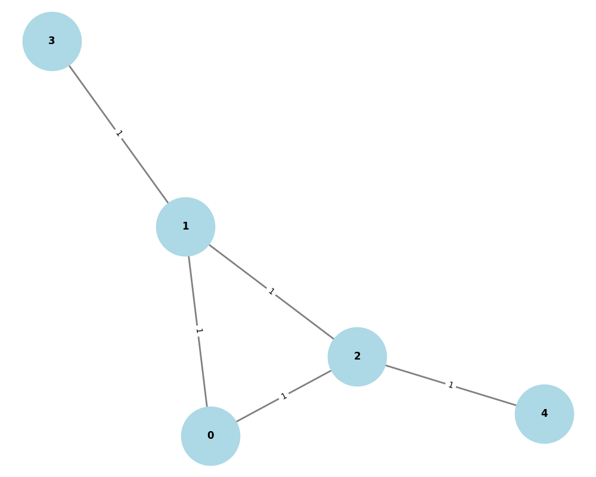
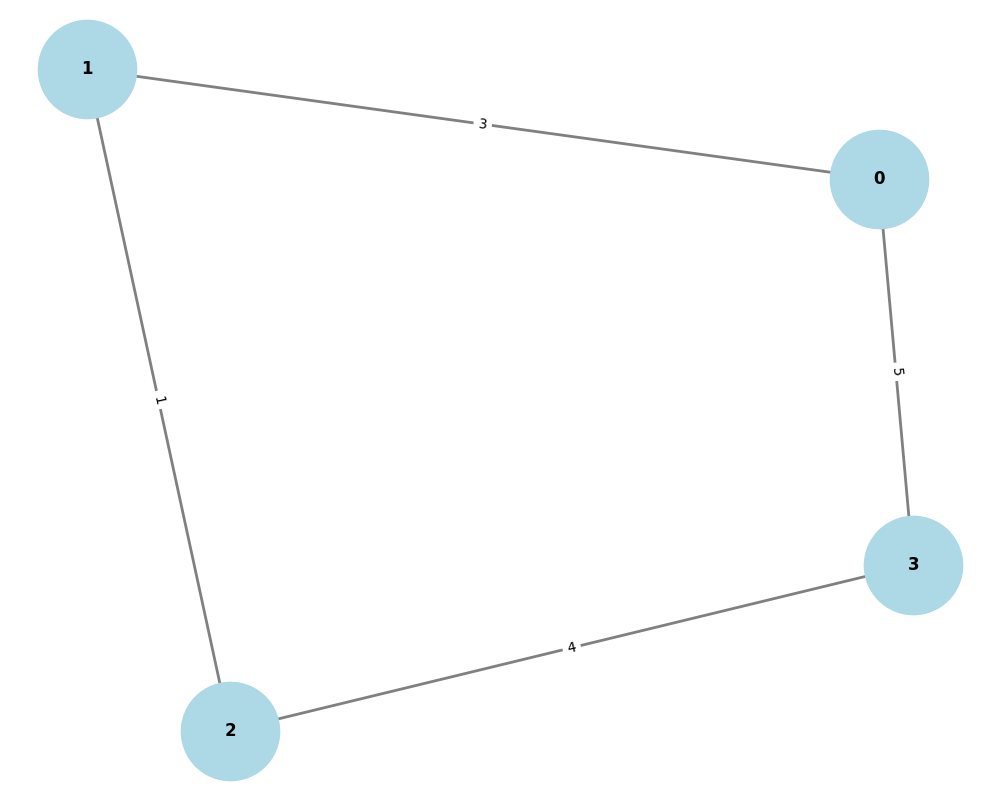

# 矩阵生成无向图（有向图）


```python
import networkx as nx
import matplotlib.pyplot as plt
import numpy as np

# 示例1：创建一个简单的邻接矩阵（5个节点的无向图）
adj_matrix = np.array([
    [0, 1, 1, 0, 0],  # 节点0与1、2相连
    [1, 0, 1, 1, 0],  # 节点1与0、2、3相连
    [1, 1, 0, 0, 1],  # 节点2与0、1、4相连
    [0, 1, 0, 0, 0],  # 节点3与1相连
    [0, 0, 1, 0, 0]   # 节点4与2相连
])

# 示例2：加权邻接矩阵（有向图）
# adj_matrix = np.array([
#     [0, 2.1, 0, 5],
#     [3, 0.5, 1, 0],
#     [0, 0, 0, 4],
#     [0, 0, 0, 0]
# ])

# 1. 从邻接矩阵创建图对象
G = nx.from_numpy_array(adj_matrix, create_using=nx.Graph())  # 无向图
# 若为有向图，使用 nx.DiGraph()

# 2. 设置节点标签（可选，若矩阵未包含标签）
if len(G.nodes) == adj_matrix.shape[0]:
    node_labels = {i: f"节点{i}" for i in range(adj_matrix.shape[0])}
    nx.set_node_attributes(G, node_labels, 'label')

# 3. 可视化参数设置
plt.figure(figsize=(10, 8))
pos = nx.spring_layout(G)  # 布局算法（弹簧布局）

# 4. 绘制节点和边
nx.draw(G, pos, with_labels=True, 
        node_color='lightblue', 
        node_size=5000, 
        font_size=12, 
        font_weight='bold',
        edge_color='gray', 
        width=2)

# 5. 显示加权边（若有）
if isinstance(G, nx.DiGraph) or isinstance(G, nx.Graph):
    edge_labels = nx.get_edge_attributes(G, 'weight')
    if edge_labels:
        nx.draw_networkx_edge_labels(G, pos, edge_labels=edge_labels)

plt.title("矩阵转换的联系图", fontsize=15)
plt.tight_layout()
plt.show()
```


<div><figure><figcaption><p>无向图</p></figcaption></figure> <figure><figcaption><p>有向图</p></figcaption></figure></div>
