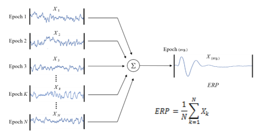
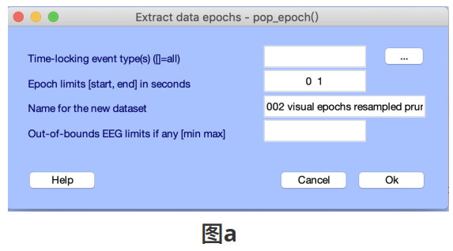
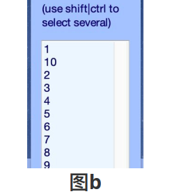

# ERP 介绍

**EPR (Event Related Potential) 事件相关的诱发电位**，是把EEG信号通过叠加平均方式得到的将脑电信号提出。&#x20;

EEG 中包含各种随机噪音，而相应认知过程的ERP波形基本上是相同的，因而在进行叠加时，ERP会与叠加的次数线性相关（其实就是增强信噪比）。在 实验过程中，被试多次接受重复的刺激，之后对产⽣的EEG进叠加平均（叠加后除以叠加次数），可得到单次刺激的ERP值。

ERP 常应用于大脑皮层的感觉、情感、认知世界的电反应的测试分析。

ERP 可分为听觉诱发电位、视觉诱发电位、体感诱发电位等，也可根据潜伏期长短 分为早潜伏期诱发电位、中潜伏期诱发电位、晚(长)潜伏期诱发电位和慢波。

* **外源性成分 P1、 N1、 P2**：是与感觉或运动功能有关的人脑对刺激产生的早成分，与刺激的物理属性相关。
* **内源性成分 N2、P3**：是与知觉或认知心理加工过程有关，不受刺激的物理特性影响。也做纯心理波，如失匹配负波（mismatch negative，MMN）&#x20;
* **中源性成分**：既与物理属性相关，也与心理因素有关

**EEGLab 提取ERP**：&#x20;

1\. 对EEG数据预处理（坏道处理、头⽪定位、伪迹剔除或校正、滤波、去除伪迹等） \
2\. tools--extract epochs，会弹出**图a** 所示框&#x20;

\
3\. 点击右侧\[···]，会弹出**图b** 所示选择mark的界⾯，根据实验条件选择mark，修改Epoch limits并点击ok（1-10 均为根据实验需要打的mark, mark的具体数字及个数取决于你⾃⼰的实验程序。在本示例中， 1-2为条件 ⼀， 3-6为条件⼆， 7-10为条件三； Epoch limits的选择取决于数据处理的⽅案，如对刺激锁时的处理，实验 中以刺激呈现的前200ms作为baseline，主要想看刺激呈现后1000ms内的认知过程，此处填-0.2 1。具体时间段的选择可以参考⾃⼰实验数据处理的相关⽂献）&#x20;

4\. 之后会出现⼏个框，都点ok即可。之后eeglab的界⾯的⼏个参数会发⽣变化，如**图c**所示：&#x20;

1. frams pre epoch：表示-200ms到1000ms，采样率为1000，共有1200个点.
2. epochs：表示这个实验条件下，有51个实验试次叠加平均&#x20;
3. events：在所选的时间段⾥，还有其他的被打mark的点（示例数据是⽤EGI收的，会有较多events）&#x20;
4. sampling rate：采样率1000，即每秒钟采1000个点（⼀般实验在预处理时会降采样，示例数据⽤于 decoding，没有降采样，具体需要取决于数据处理⽅案，参考相关⽂献）&#x20;
5. &#x20;epoch start， end：即为-0.2s及刺激呈现后1s&#x20;

5\. 之后可以保存叠加平均后的各条件的数据，⽅便进⾏后续各条件之间的分析。\
6\. 可在Plot⼯具框⾥作图，简单查看结果。

Reference:

`《脑电与认知神经科学》 ---⽥银、徐鹏等著` \
`《脑电信号处理与特征提取》 --胡理、张治国等著` \
`《EEG脑电信号分析⽅法及其应⽤》 --李颖洁等著`
