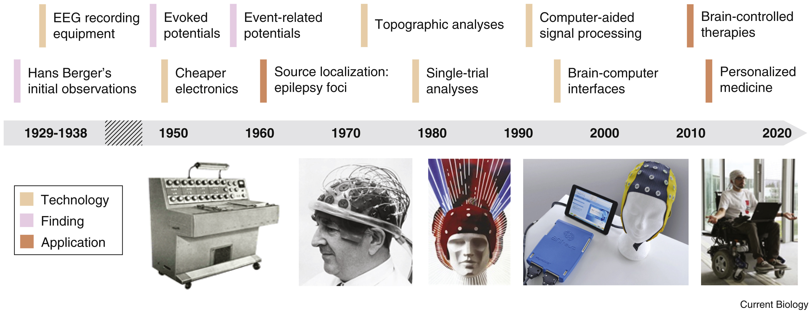

# EEG 简介

EEG 是一种通过检测大脑皮层微电压的方法来揭示人们生理信号。由于其低的成本和高的时间分辨率，已经越来越多的应用在医疗和科学研究中。 EEG 在医疗方面，主要用于头部脑损伤，脑功能障碍，失眠，中风，癫痫病等辨别和诊断；在科学研究方面，研究人员已经在神经科学、认知科学、认知心理学、神经语言学和心理生理学方面有了较为广泛和深入的研究。但是，由于目前对于 EEG 的标准化方面还做的不够，以及一些 ERP 研究报告中没有提及数据收集及必要步骤的描述。因此，较大程度的限制研究的可重复性。

* **EEG 历史**

1. **早期动物身上发现的带电现象:**&#x20;

* 1786 - Galvani 发现青蛙外周围神经和肌肉有带电现象。创立了动物电(animal electricty)学说。&#x20;
* 1875 - Richard Caton 首次在兔子大脑表面观察到自发脑电反应。&#x20;
* 1890 - Adolf Beck 也发现了狗和兔子的脑表层脑电活动，并提出了脑电去同步化过程的概念。&#x20;
* 1912 - Vladimir Vladimirovich Pravdich-Neminsky 出版了第一本关于狗的脑电图及诱发电位。

&#x20; **2. 近代EEG在人脑的研究：**

* **EEG的神经生理基础**\
  \
  大脑含有十亿多神经元，神经元由细胞体和突起组成。突起分为多分枝的树突和少分枝的轴突两种。\
  两个神经元之间通过轴突末端的突触交流。两个突触之间有间隙。

&#x20;    脑电波来源目前有三种看法：&#x20;

1. Eccle(1953)提出的细胞体或神经纤维的峰形波组成学说。
2. 中国神经生理学家张香桐提出的顶树突的动作电位即树突电位组成学说。
3. 大脑皮层神经元突触后的电位组成学说

&#x20;    目前多数学者认为神经元突触后的电位是EEG的主要组成成分。

*   **EEG的劣势：**

    \
    相对于fMRI, EEG 的空间分辨率低。信噪比差，含眼动，肌动及外部的干扰大。实验时，准备和连接EEG的时间长。

​Reference:

`Biasiucci, A., Franceschiello, B. & Murray, M.M. 2019, 'Electroencephalography', Current Biology, vol. 29, no. 3, pp. R80-R5.` \
`Luck, S. 2005, 'An Introduction to the Event-Related Potential Technique '.Rorschach. 2006, '知乎',`[`https://zhuanlan.zhihu.com/p/349622006`](https://zhuanlan.zhihu.com/p/349622006)`, '脑电信号基础介绍'.`
