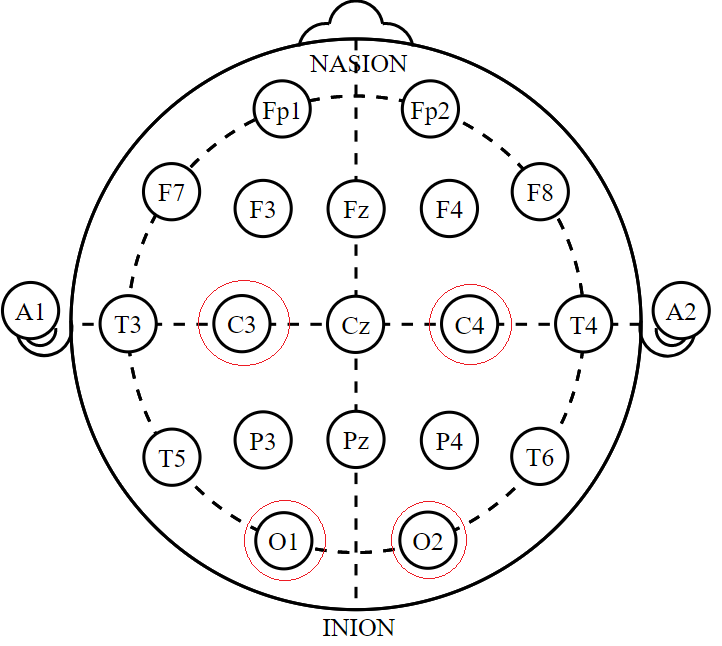

# EEG 的节律信号

神经振荡（Neural Oscillations）是由神经元之间交互作用引发，也是EEG的主要特征。

**Delta 频段δ：** 0.5～4Hz（20-200μV）主要在深度睡眠时出现&#x20;

**Theta 频段θ**： 4～8Hz（100-150μV）出现在冥想及浅度睡眠状态，此外记忆，运算时可以诱发出来。

**Alpha 频段α：** 8～13Hz（20-60μV） 在清醒、放松和安静闭眼的状态下，枕叶和顶叶较为明显。并与认知、年龄有关。 但是，不同的皮层区域有各自不同的Alpha节律。 感觉运动皮层/顶叶：C3, C4电极，肌肉放松时会增强，反之降低。 视觉皮层/枕叶：O1, O2电极在闭眼时，大幅加强。

**Beta 频段β：** 12～30Hz（5-20μV）出现在注意力集中，逻辑思维，警觉或焦虑时。 Beta波在感觉运动皮层随自发睁眼和闭眼而变化。 在额叶区，与决策与认知活动有关。&#x20;

**Gamma 频段γ**： 30～80Hz（电压很小）与认知有关。多随着激动、兴奋、识别、感知及短时记忆等，具有多重功能。

**研究意义**：神经振荡与知觉、认知、运动和情绪加工等有密切相关。通过对节律信号的分析和特征提取对了解识别大脑内部活动有积极的意义。

脑电EEG研究的用途：

* 心理学方面：注意、情绪及认知训练方面的研究。
* 医学方面：对失眠机制的了解，癫痫、精神分裂疾病诊断，及神经精神障碍的药物评估。

Reference: \
`《脑电信号处理与特征提取》 -- 胡理、张治国等著` \
`《Chapter2: EEG节律及其意义》-- 澳⻔⼤学李⼩花`
