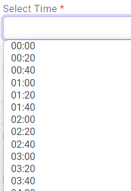

# Dropdown time selection with interval

<figure><figcaption></figcaption></figure>



```
// only can generate time interval in [5,10,15,20,30,60]
  generateTimeInterval10mins() {
    const interval = 20 // minute: 5,10,15,20,30,60
    for (let i = 0; i < 24; i++) {
      for (let j = 0; j < 60; j += interval) {
        const hours = (i < 10 ? '0' : '') + i;
        const minutes = (j < 10 ? '0' : '') + j;
        this.timeIntervals.push(`${hours}:${minutes}`);
      }
    }
  }


// generate time interval in [5,10,15,20,25,30,35,40,45,50,60,120,180,240,300,360]
  generateTimeIntervals() {
    const interval = 20 // minute: 5,10,15,20,25,30,35,40,45,50,60,120,180,240,300,360
    const totalMinutes = 24 * 60; // minutes of 24 hour

    for (let i = 0; i < totalMinutes; i += interval) {
      const hours = Math.floor(i / 60).toString().padStart(2, '0');
      const minutes = (i % 60).toString().padStart(2, '0');
      this.timeIntervals.push(`${hours}:${minutes}`);
    }
  }


```



```
// Some code

        <select class="form-control" id="timeSelect" formControlName="bookingTime" >
          <option *ngFor="let time of timeIntervals" [value]="time">
            {{ time }}
          </option>
        </select>

```


