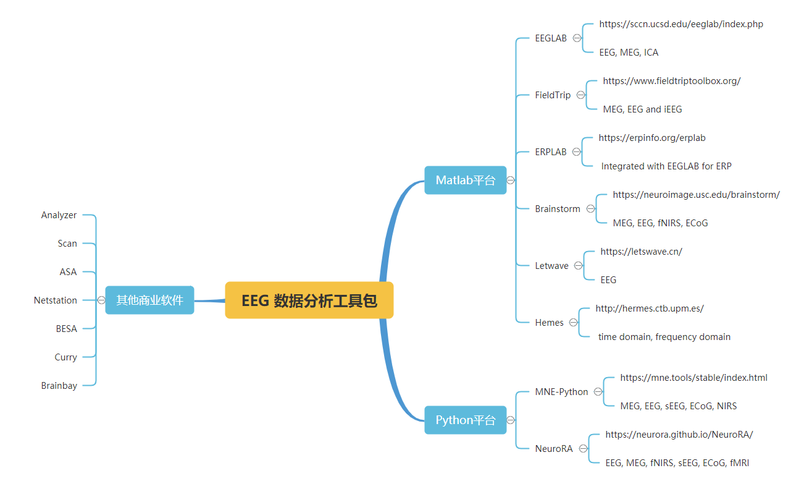

# EEG 数据分析软件

EEG 数据分析工具主要集中在两种平台上：Matlab 和 Python。此外还有一些商业EEG数据分析软件。以下脑图是这些工具的详细描述。不同的软件工具包提供了不同的功能。其中最常用的是EEGLAB。

Reference\
[ https://7988888.xyz/EEG-software/](https://7988888.xyz/EEG-software/)

